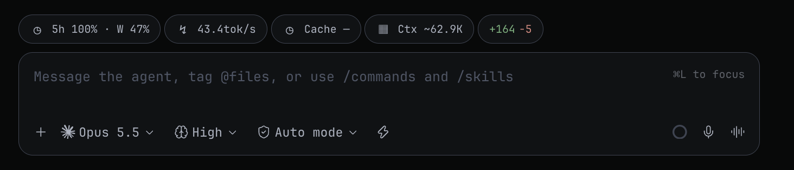
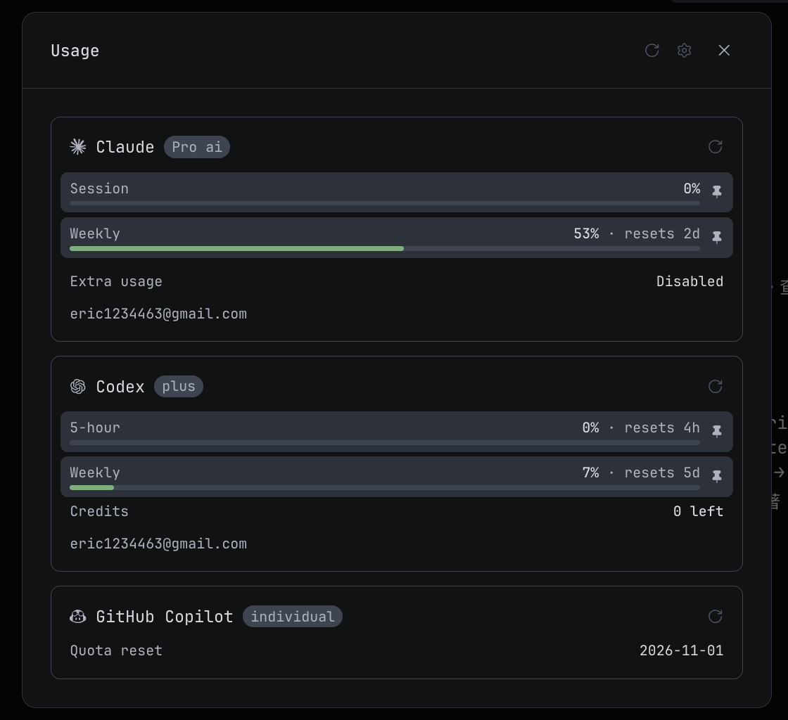
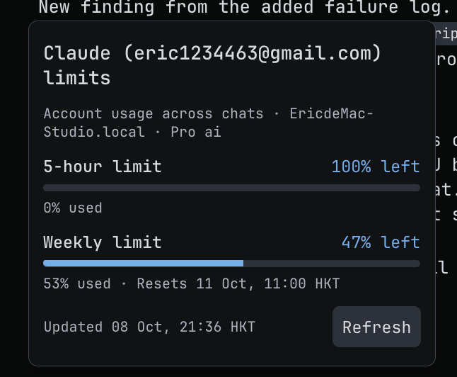
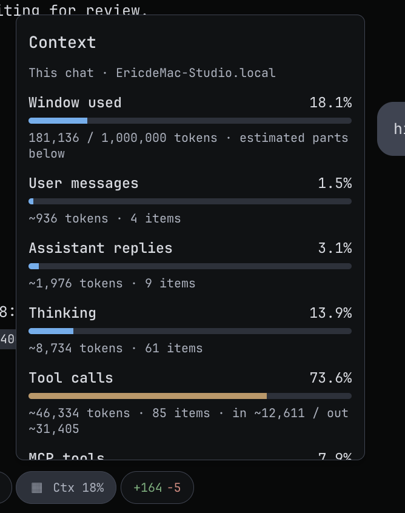
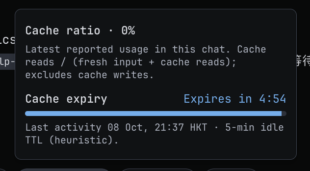

# Paseo Token Analyst

Token analysis and a usage gateway for Paseo. Composer pills, per-model history,
and account windows turn Codex, Claude, and Grok usage into readable numbers,
and a pull-based resume prompt hands unfinished work to a new agent before an
account limit is reached.

## Screenshots

Composer pills:



Usage popover with account windows:



Limits popover:



Context popover:



Cache popover:



## What the pills show

| Pill | Shows |
| --- | --- |
| `5h 100% · W 47%` | Remaining five-hour and weekly allowance, with reset times in HKT (UTC+8). Turns into a red `STOP` warning at 90% (5-hour) or 95% (weekly) used. |
| `43.4tok/s` | Average output throughput of the last completed turn, including tool runs and waits. |
| `Cache 4:32` | Prompt cache ratio of this chat, with a freshness countdown (5-minute idle TTL heuristic). |
| `Ctx ~62.9K` | How much of this chat's context window is used. Click for a breakdown by message type. |

Clicking the limits pill opens the usage popover: usage bars, extra provider
windows, and a **Copy resume prompt** button. Missing data shows `Not provided`,
never zero.

## Handoff before the limit hits

Paseo plugins cannot block a send or stop a running turn, so the plugin works as
a soft stop-line plus a handoff:

- **Copy resume prompt** in the limits popover copies a prompt for a new agent.
  The new agent reads the old agent's timeline with `paseo logs <agent-id>`,
  inspects the repo, worktree, and uncommitted changes itself, then continues
  the unfinished work.
- **↺ Resume…** button in the workspace header does the same from the other
  side: type the previous agent's id, confirm, and a new agent starts with the
  resume prompt. Provider and model follow the previous agent.

## Token usage sidebar

The **Token usage** sidebar page shows a Codex and Claude account overview, then
per-provider tabs with model totals: input, cache input, total input, and
output. The default range is the last 7 days in HKT, with daily, monthly, and
custom date ranges, and a daily stacked bar chart for 7-day and monthly views.

## Install

Requires Paseo daemon and client 0.11.0 or later with plugins enabled.

```sh
paseo plugin install npm:paseo-token-monitor-plugins
```

You can also paste `npm:paseo-token-monitor-plugins` into
**Settings → Plugins → Plugin source** in the app.

To work on the plugin source instead:

```sh
npm install
npm run typecheck
npm test
paseo plugin install <path-to-this-repo>
```

Install on the daemon whose account usage you want to view. After editing source:

```sh
paseo plugin reload paseo-token-monitor-plugins
paseo plugin ls paseo-token-monitor-plugins
```

## How it works, privacy, and limits

- Codex and Grok usage comes from the connected host's usage API. Claude uses
  the same data when available, otherwise the daemon calls the Claude Code
  OAuth usage endpoint with the existing local sign-in (this endpoint is not a
  documented public contract and can change).
- Credentials stay in server memory and are sent only to Anthropic's usage
  endpoint. They never appear in RPC results, client bundles, files, or logs.
- History is computed from retained local CLI logs (`CODEX_HOME`,
  `CLAUDE_CONFIG_DIR` / `CLAUDE_HOME`, and `GROK_HOME` are honored). Nothing is
  written to the source logs; only model names and token aggregates reach the
  client.
- Account windows cover the whole configured account, including other chats.
  This is not an account billing report: deleted logs, other devices, and
  unrecorded usage are excluded.
